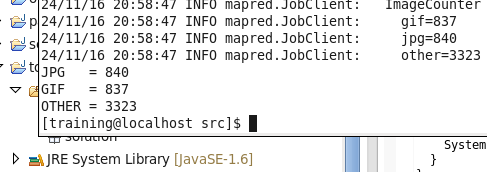

This lab uses a Map-only MapReduce job to analyze web server access logs, counting occurrences of requests for image files by their 
extensions (.jpg, .gif, etc.).


1. ImageCounter.java (Driver Code)
**Purpose**: Sets up and runs the MapReduce job, including configurations and retrieving final counter values.<br>
**Key Points:**<br>
Input and Output Directories: It expects two arguments, the input (directory with logs) 
and output directory.<br>
**Map-only Job:** By setting job.setNumReduceTasks(0);, the job only uses mappers without reducers.<br>
Counters Retrieval: After the job completes, it retrieves values from the counters jpg, gif, 
and other within the ImageCounter counter group and prints the counts.<br>

2. ImageCounterMapper.java (Mapper Code)
**Purpose:** Processes each line in the log file, checks for file extensions, and increments 
counters based on whether the file type is .jpg, .gif, or another.<br>
**Key Points**:<br>
 - Splitting the Line: It splits each line using double quotes to extract the HTTP request part, then further splits this section to get the file name.
 - File Extension Check: Checks the file extension (converted to lowercase) and increments the appropriate counter:
	- jpg if the file ends with .jpg
	- gif if the file ends with .gif
	- other for all other files
## How to run
Go to dir
```
cd ~/workspace/counters/src
```

Java to class
```
javac -classpath `hadoop classpath` stubs/*.java

```
Collect all class and compile to jar
```
jar cvf counter.jar stubs/*.class

```
Run it
```
hadoop jar counter.jar stubs.ImageCounter /user/training/testlog /user/training/output

```	


	
## Output.

The output will be empty in the HDFS output directory because this is a map-only job, and mappers do not write any key-value pairs to output files. 
Instead, it uses counters to display results, and the output will be visible in the console, similar to:

```
JPG   = <count_of_jpg_requests>
GIF   = <count_of_gif_requests>
OTHER = <count_of_other_requests>
```
