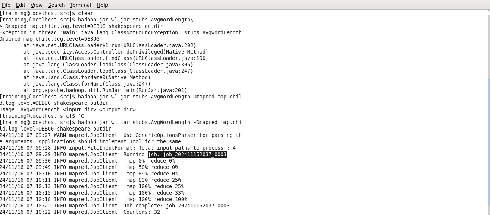
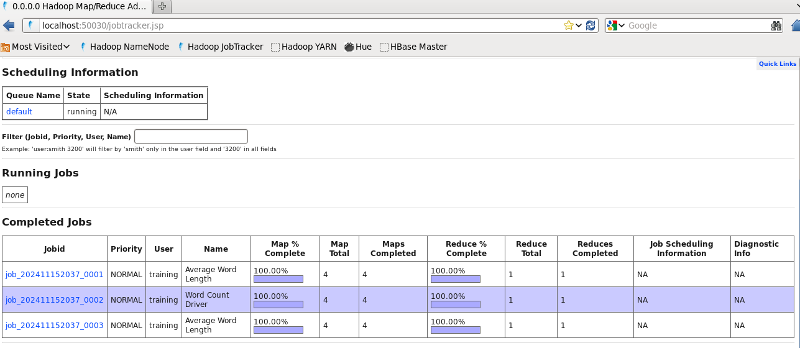
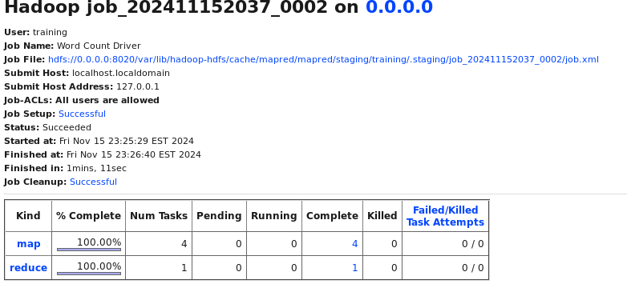

# Using log4j with MapReduce

log4j (Logging for Java) is a popular Java-based logging library developed 
by the Apache Software Foundation. It is used to add logging capabilities to Java 
applications, allowing developers to record information about the application's 
runtime behavior, such as error messages, debug messages, and other useful data points.

## Step 1: Enable Mapper Debug Logging

To enable Mapper logging in debug mode without changing any code, re-run the 
**AvgWordLength** program with the -Dmapred.map.child.log.level=DEBUG option:

```
hadoop jar toolrunner.jar stubs.AvgWordLength -Dmapred.map.child.log.level=DEBUG shakespeare outdir

```
## Step 2: View the log 
Ppen the Job Tracker UI at http://localhost:50030/jobtracker.jsp





## Add Logging Code to Mapper

1. AvgWordLength (Driver Class)
This class sets up and configures the MapReduce job. It takes input and output 
paths, sets up the mapper and reducer, and configures key and value types for the job.<br>

main: Calls ToolRunner.run() to run the job.<br>
run: Checks if input and output paths are provided, configures the job settings (e.g., mapper and 
reducer classes, job name, and input/output paths), and submits the job to the cluster.<br>

2. LetterMapper (Mapper Class)
This class processes each line of text, splits it into words, and 
outputs the first letter of each word as the key, with the word length as the value.<br>

Uses log4j to log a debug message if debug logging is 
enabled, indicating whether case sensitivity is on or off.<br>

map: Processes each word, extracts the first letter, and emits it along with the word's length.<br>
setup: Reads the configuration setting caseSensitive to determine if words should be compared case-sensitively 
or case-insensitively and logs this information.<br>

3. AverageReducer (Reducer Class)
 For each letter key, it calculates the average length of words that start with that letter.<br>
 reduce: Calculates the average length of words for a given starting letter by summing lengths and 
 counting the words, then writes the result to output.<br>