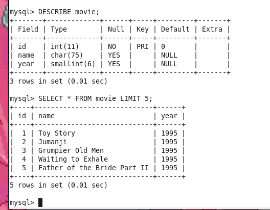
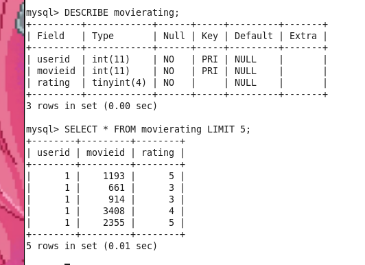

# Use Sqoop to import data from a MySQL
The goal is to use Sqoop to import data from a MySQL database into Hadoop, specifically the tables movie and movierating from the movielens database. This data will be used for analysis in future labs.

1. Log into MySQL:
```
mysql --user=training --password=training movielens

```

2. Examine the structure of the movie table:
```
DESCRIBE movie;
SELECT * FROM movie LIMIT 5;

```

3. Examine the structure of the movierating table:
```
DESCRIBE movierating;
SELECT * FROM movierating LIMIT 5;

```


4. Exit by `quit`

## Sqoop commands

```
sqoop help
```
List of available databases
```
sqoop list-databases \
--connect jdbc:mysql://localhost \
--username training --password training
```
List tables in the movielens database:
```
sqoop list-tables \
--connect jdbc:mysql://localhost/movielens \
--username training --password training

```

Import Tables into Hadoop Using Sqoop
```
sqoop import \
--connect jdbc:mysql://localhost/movielens \
--username training --password training \
--fields-terminated-by '\t' --table movie

```

Verify the import worked:
```
hadoop fs -ls movie
hadoop fs -tail movie/part-m-00000

```

similarly importing `movierating`
```
sqoop import \
--connect jdbc:mysql://localhost/movielens \
--username training --password training \
--fields-terminated-by '\t' --table movierating


hadoop fs -ls movierating
hadoop fs -tail movierating/part-m-00000
```


# Part 2: Running an Oozie Workflow


Start the Oozie Server
```
sudo /etc/init.d/oozie start

```
This command starts the Oozie server, which manages and coordinates jobs in Hadoop workflows.
Oozie workflows consist of tasks (like MapReduce jobs) and their dependencies, defining the sequence in which they execute.

Navigate to directory
```
cd ~/workspace/oozie-labs
```

 Changes the directory to the workspace for this lab where the Oozie job folders (lab1-java-mapreduce and lab2-sort-wordcount) are stored.
- Inspect job.properties and workflow.xml Files in lab1-java-mapreduce/job

		- The job.properties file contains configuration properties for the job, including:

			- Base Directory: The root directory for the job files in HDFS.
			- Input and Output Directories: Relative paths for the input and output files in HDFS, where WordCount reads input data and stores results.
		- The workflow.xml file defines the Oozie workflow steps, specifying:
			- The sequence of tasks, dependencies, and the job type (e.g., a Java MapReduce job).
			- How WordCount operates in this workflow, including its setup and output handling.
		
		
Inspect and Run the Shell Script run.sh
```
./run.sh lab1-java-mapreduce

```
- This script submits the Oozie workflow to run the lab1-java-mapreduce job. Running run.sh automates the job submission instead of entering Oozie commands manually.
- When executed, Oozie will respond with a job identification number, which is essential for tracking the job’s progress.

Check the Job Progress

```
oozie job -oozie http://localhost:11000/oozie -info job_id

```

*Replace job_id with the actual ID returned from the previous step.*
*This command queries the Oozie server at localhost:11000 to check the status of the job.*

```
[training@localhost ~]$ cd ~/workspace/oozie-labs
[training@localhost oozie-labs]$ ls
cloudera-dev-training-1.0-SNAPSHOT.jar  lab1-java-mapreduce  lab2-sort-wordcount  run.sh
[training@localhost oozie-labs]$ cd ~/workspace/oozie-labs/lab1-java-mapreduce/job
[training@localhost job]$ cat job.properties
nameNode=hdfs://localhost:8020
jobTracker=localhost:8021
queueName=default
baseDir=${nameNode}/user/${user.name}/lab1-java-mapreduce
oozie.wf.application.path=${baseDir}/job
oozie.libpath=${oozie.wf.application.path}/lib
inputDir=${baseDir}/input
outputDir=${baseDir}/output
[training@localhost job]$ cat job.properties
nameNode=hdfs://localhost:8020
jobTracker=localhost:8021
queueName=default
baseDir=${nameNode}/user/${user.name}/lab1-java-mapreduce
oozie.wf.application.path=${baseDir}/job
oozie.libpath=${oozie.wf.application.path}/lib
inputDir=${baseDir}/input
outputDir=${baseDir}/output
[training@localhost job]$ cat workflow.xml
<workflow-app xmlns="uri:oozie:workflow:0.1" name="word-count">
    <start to="wordcount-node"/>
    <action name="wordcount-node">
        <map-reduce>
            <job-tracker>${jobTracker}</job-tracker>
            <name-node>${nameNode}</name-node>
            <prepare>
                <delete path="${outputDir}"/>
            </prepare>
            <configuration>
                <property>
                    <name>mapred.mapper.class</name>
                    <value>hadoop.dev.wordcount.mapred.WordMapper</value>
                </property>
                <property>
                    <name>mapred.mapoutput.key.class</name>
                    <value>org.apache.hadoop.io.Text</value>
                </property>
                <property>
                    <name>mapred.mapoutput.value.class</name>
                    <value>org.apache.hadoop.io.IntWritable</value>
                </property>
                <property>
                    <name>mapred.reducer.class</name>
                    <value>hadoop.dev.wordcount.mapred.SumReducer</value>
                </property>
                <property>
                    <name>mapred.input.dir</name>
                    <value>${inputDir}</value>
                </property>
                <property>
                    <name>mapred.output.dir</name>
                    <value>${outputDir}</value>
                </property>
            </configuration>
        </map-reduce>
        <ok to="end"/>
        <error to="fail"/>
    </action>
    <kill name="fail">
        <message>Map/Reduce failed, error message[${wf:errorMessage(wf:lastErrorNode())}]</message>
    </kill>
    <end name="end"/>
</workflow-app>
[training@localhost job]$ 

```