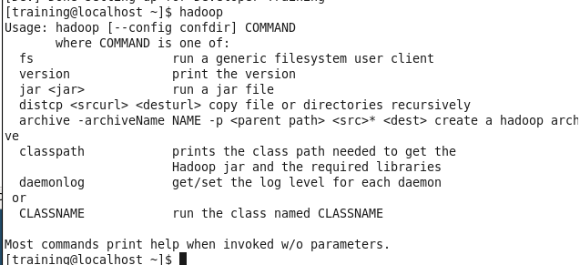

[](https://git.io/typing-svg)

---

This notes make use of the CLoudera Training VM, The VM image is can be found [here](https://drive.google.com/file/d/1pizgWHk6VAgCgpiMXeFbGqQ4KmY41NJ3/view)

### Getting Started: Transferring files back and forth via VM Ware

Once we turn on the VM, the following steps are done<br>
- Player>Removable Devices>Network Adapter> Settings
- Options> Shares Folders, select *Always enables*
- On folders, add your machines local folders path
- The files can be found on this path of the VM Training/File System/mnt/hgfs

**Setting it up**<br>
Open virtual machine > select the .vmx file/d/1pizgWHk6VAgCgpiMXeFbGqQ4KmY41NJ3/view

## Using HDFS
Hadoop is an **open-source framework** designed for storing and processing large datasets 
across multiple machines in a distributed environment. It's particularly useful for 
big data tasks because it allows large datasets to be stored, processed, and analyzed 
in parallel, which makes it much faster and scalable compared to traditional data processing.<br>

*HDFS (Hadoop Distributed File System):*

- file system that splits large files into smaller blocks and distributes them across multiple machines, creating a "distributed" storage.
- HDFS allows for fault tolerance by replicating these blocks on different machines, so data isn’t lost if one machine fails.

#### This command is used to upload files from the local file system to HDFS
```
hadoop fs -put shakespeare /user/training/shakespeare
```
#### Listing files in HDFS
```
hadoop fs -ls /user/training/

```

#### Removing files from HDFS
```
hadoop fs -rm /user/training/shakespeare

```

#### Viewing files in HDFS
````
hadoop fs -cat /user/training/shakespeare

````
### Text Editors in linux

1. Nano
  - Type: Command-line-based text editor
  - Interface: Runs directly in the terminal
  - User-Friendliness: Beginner-friendly with a simpler interface
  - Shortcut Guidance: Shows helpful shortcuts at the bottom of the screen (e.g., ^X for Exit, where ^ means "Ctrl")
  - Usage: Ideal for quick edits, especially when working over SSH or without a graphical interface
  - Sample usage: `nano myfile.txt`
2. Gedit
 - Type: Graphical text editor
 - Interface: GUI-based with menus, buttons, and a visual interface
 - User-Friendliness: Very beginner-friendly for users used to traditional text editors like Notepad on Windows
 - Syntax Highlighting: Supports syntax highlighting for coding, making it ideal for editing code
 - Usage: Good for writing code or editing files in a graphical Linux environment
 - Sample usage: `gedit myfile.txt &`


## Setting up the environment

Run script to configure environment
```
~/scripts/developer/training_setup_dev.sh

```
**What this does:** <br>
The ~ symbol represents the home directory. <br>
The script path suggests it is located in a folder called scripts/developer/. <br>
Running this script sets up necessary configurations or installations that the labs will require.<br>
**Understanding Hadoop**<br>
Hadoop is already installed, configured, and running on the virtual machine <br>
To receive a help message that outlines how to use the command and its various options
```
hadoop
```


### unzipping n inserting to HDFS from local directory
- Change to local directory `$ cd ~/training_materials/developer/data`
- Run `ls`, see the two files: shakespeare.tar.gz and shakespeare-stream.tar.gz.
- unzipping it by using `$ tar zxvf shakespeare.tar.gz`
- Upload to HDFS, `$ hadoop fs -put shakespeare /user/training/shakespeare`
   1. hadoop fs: This command interacts with the Hadoop file system.
   2. -put: This option is used to upload files or directories from the local filesystem to HDFS.
- list contents in HDFS `$ hadoop fs -ls /user/training`
### uploading a compressed web server log file to HDFS
- create new dir `$ hadoop fs -mkdir weblog`
- `$ gunzip -c access_log.gz | hadoop fs -put - weblog/access_log`
- gunzip -c access_log.gz: This command decompresses the access_log.gz file. 
- The -c option tells gunzip to write the uncompressed output to standard output (stdout) instead of creating a file on disk.
- '|' This is a pipe operator, takes the output of the command on the left and sends it as input to the command on the right.
- verify upload `$ hadoop fs -ls weblog`


### create a smaller version of the weblog
- Extract the first 5000 lines from the original log file and upload it to HDFS
```
$ gunzip -c access_log.gz | head -n 5000 | hadoop fs -put - weblog/access_log_small
```
- gunzip -c access_log.gz: Decompresses the file, as before.
- | head -n 5000: This takes the output from gunzip and extracts the first 5000 lines. The head command is used to display the beginning of a file.
- | hadoop fs -put - weblog/access_log_small: This uploads the first 5000 lines to HDFS, naming the file access_log_small in the weblog directory.

#### further stuff

```
$ hadoop fs -cat shakespeare/histories | tail -n 50
```
Viewing the End of a Large File: This command is particularly useful when dealing with large output files from MapReduce
programs. Often, the results generated can be quite large, making it impractical to view the entire content at once.<br>
Quick Insights: By using tail, we can quickly check the end of the output for errors, results, or any specific 
information without scrolling through a massive amount of text.<br> Debugging and Monitoring: 
This can be helpful for monitoring logs or outputs in real time or checking for specific patterns or results 
generated by a MapReduce job.<br>

```
$ hadoop fs -get shakespeare/poems ~/shakepoems.txt
```
hadoop fs -get: This command is used to copy files from HDFS to the local filesystem.<br>
shakespeare/poems: This is the source path in HDFS from which we want to copy the file. 
In this case, it’s the poems file located in the shakespeare directory.<br>
~/shakepoems.txt: This is the destination path on the local filesystem where we want to save the downloaded file.
The ~ symbol refers to our home directory, and shakepoems.txt is the name we want to give to the downloaded file.<br>
Action: This command will copy the poems file from HDFS and save it as shakepoems.txt in home directory on the 
local filesystem.

```
$ less ~/shakepoems.txt
```
This command is a file viewer that allows to view the contents of files in a scrollable format.
We can navigate through the file using the arrow keys, and or exit the viewer by pressing q.

## Topics

```
cd ~/workspace/
```

- [Week 2: Map Reduce](./MapReduce)
- [Week 3: MRUnit Testing](./MRUnit)
- [Week 4: Toolrunner](./Toolrunner)
- [Week 4: Combiner](./Combiner)
- [Week 5: Toolrunner](./Toolrunner_pt2)
- [Week 5: Logging](./Logging)
- [Week 5: Counters](./Counters)
- [week 6: Writables](./Writables)
- [Week 6: createsequencefile](./Sequence)
- [Week 6: Practicioner](./Practicioner)
- [Week 7: Inverted Index](./Index)
- [Week 7: Word Co Occurance](./WordCo)
- [Week 8: Sqoop, MySQL and Oozie workflow](./MySQL)
- [Week 9: ETL process](./ETL)
- [Week 10: ](./)
- [Week 11: ](./)
- [Assignment 2](./)


