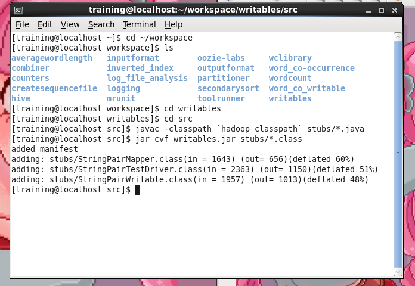
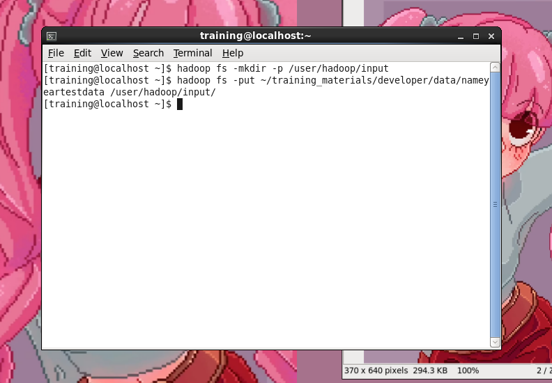
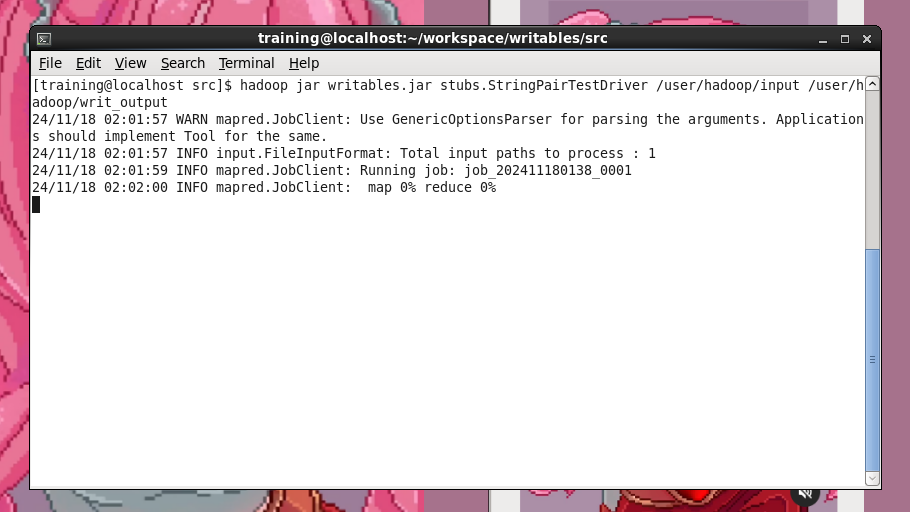
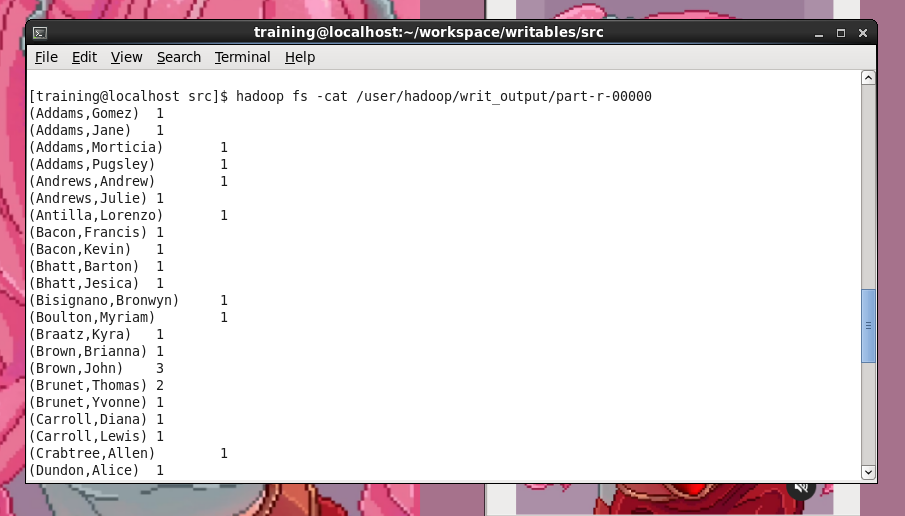

# Writables

In this lab, the goal is to create a custom WritableComparable 
type for counting occurrences of name pairs (last name, first name) from a dataset.

## Breakdown of the Tasks
1. Custom WritableComparable Type (StringPairWritable):
	- A WritableComparable is a Hadoop interface that allows custom data types to be used in the MapReduce framework. It extends both Writable (for serialization) and Comparable (for sorting).
	- Need to implement a custom class called StringPairWritable that holds two strings: the last name and the first name. This class will:
		- Implement Writable:  define methods for serialization (write) and deserialization (readFields).
		- Implement Comparable: define how to compare the two String values to allow sorting in the MapReduce framework.

2. Mapper:
	- The mapper will read lines in the format lastname firstname other data. It will split each line by spaces and extract the last name and first name.
	- The mapper will emit a key-value pair where the key is a StringPairWritable containing the last name and first name, and the value is the number 1, representing one occurrence of that name.

3. Reducer:
	- The reducer will receive the StringPairWritable keys and the values (which are the counts of occurrences) from the mappers.
	- The reducer will sum the counts for each unique name pair and output the final counts.
	
### Input 
```
Smith Joe 1963-08-12 Poughkeepsie, NY
Smith Joe 1832-01-20 Sacramento, CA
Murphy Alice 2004-06-02 Berlin, MA

```
### output
```
Smith,Joe 2
Murphy,Alice 1
```


## Codes

1. StringPairWritable.java (Custom WritableComparable)
This class represents a custom data type, StringPairWritable, that holds two String values: left and right. This class implements both Writable and Comparable, which allows it to be used as a key in a Hadoop MapReduce job.

	- Constructor:

		- The first constructor is the default (empty) constructor, which is required for Hadoop serialization. The second constructor initializes the left and right fields with the provided values.
	- write() & readFields(): These methods handle the serialization and deserialization of the object. The write() method writes the two strings (left and right) to the output stream, while readFields() reads them from the input stream.

	- compareTo(): This method implements the comparison logic between two StringPairWritable objects. It first compares the left values, and if they are equal, it compares the right values. This allows sorting the name pairs lexicographically first by last name and then by first name.

	- toString(): The toString() method provides a string representation of the object in the form of (left,right), which is useful for displaying the key in the output.

	- equals() & hashCode(): These methods are used for object equality checks and hash code generation. These are necessary for the StringPairWritable object to behave correctly in collections and for comparing key-value pairs.
	
---
	
2. StringPairMapper.java (Mapper)
	- Mapper Class: The StringPairMapper extends Mapper<LongWritable, Text, StringPairWritable, LongWritable>. This means that the input to the mapper is a LongWritable key (representing the byte offset of the line in the input file) and a Text value (representing the line of text itself).

	- map() Method: This method processes each input record. It splits the input line by non-word characters (\\W+), extracting the first two words (the last name and first name) and discards any other data.

		- It then creates a StringPairWritable key with the last name and first name.
		- The mapper emits this StringPairWritable key paired with the value 1 (indicating one occurrence of that name pair).
	- Context.write(): The key-value pair (StringPairWritable as key and LongWritable(1) as value) is passed to the Hadoop framework for further processing.	
	
---

3. StringPairTestDriver.java (Job Driver)
	- Job Setup: This class configures and runs the MapReduce job. It uses the Hadoop Job class to set up the job configuration.

	- FileInputFormat & FileOutputFormat: These methods specify the input and output paths for the job. The input path is the directory containing the input data, and the output path is where the results will be written.

	- Mapper and Reducer:

		- The mapper class (StringPairMapper) is specified, which will process the input data.
		- The reducer class (LongSumReducer) is specified. This class is used to sum the values associated with each key. In this case, the LongSumReducer will sum up the occurrences of each name pair.
	- Output Key and Value Classes: The output key is a StringPairWritable (custom key type), and the value is a LongWritable (the count of occurrences).

	- Running the Job: The job is submitted and executed with job.waitForCompletion(true). If successful, the method returns 0; otherwise, it returns 1.
	

---

# CLI running it
 Go to directory, create class files and compile it to jar
 
 Create necessary directory and put the datafile to hdfs
 
 run the job on specified directory
 
 use cat to view output
 