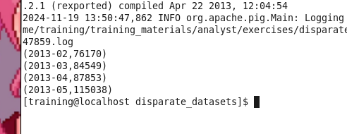
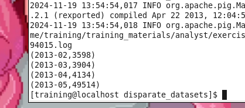
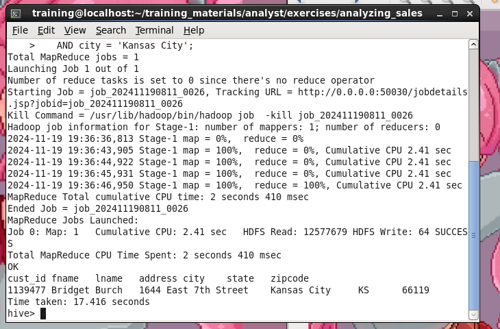
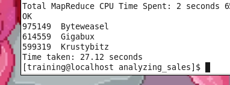
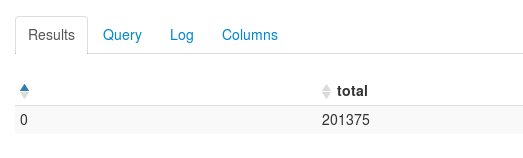
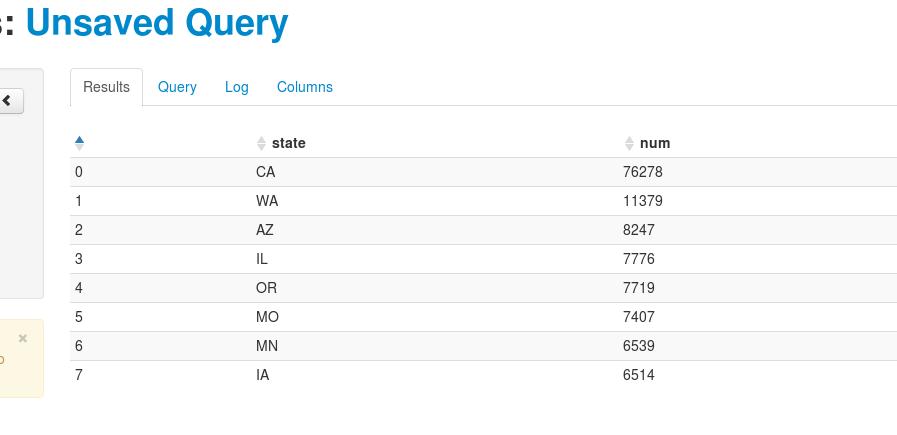
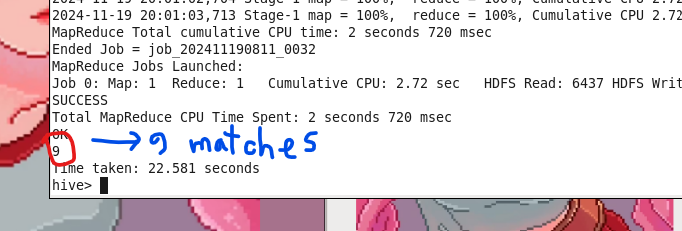
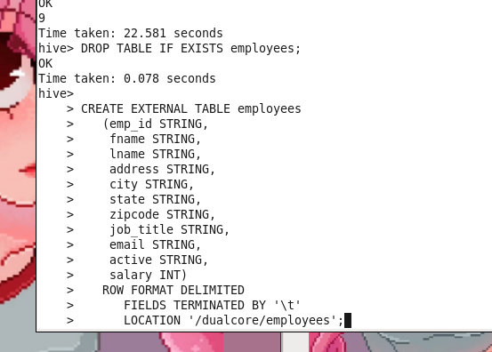
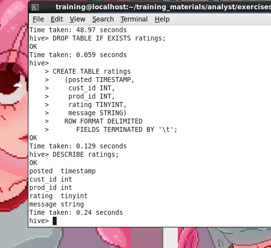

# Week 10 lab

## Show Per-Month Sales Before and After Campaign

nano into count_orders_by_period.pig<br>
then run it by 

```
pig count_orders_by_period.pig

```

the output is: <br>


## Count Advertised Product Sales by Month

Open the file for editing:

```
nano count_tablet_orders_by_period.pig
```

we edit and then run the cript

```
pig count_tablet_orders_by_period.pig

```

the results <br>


# Week 11 lab

we start hive

```
hive

```

Make the query results easier to read by setting the property that will make
Hive show column headers

```
set hive.cli.print.header=true;
```

**Question: All you know about the winner is that her name is Bridget and she lives in**
**Kansas City. Use Hive's LIKE operator to do a wildcard search for names such as**
**"Bridget", "Bridgette" or "Bridgitte". Remember to filter on the customer's city**

```
SELECT *
  FROM customers 
 WHERE fname LIKE 'Bridg%'
   AND city = 'Kansas City';
```

output:<br>
<br>


running query from the cli

```
hive -e 'SELECT price, brand, name FROM PRODUCTS
ORDER BY price DESC LIMIT 3'
```

output:<br>
<br>


hue gui

```
http://localhost:8888/
```

First Query output: <br>
<br>


Second Query output: <br>
<br>

## Data Management with Hive

using sqoop to import tables

```
cd $ADIR/exercises/data_mgmt


sqoop import \
--connect jdbc:mysql://localhost/dualcore \
--username training --password training \
--fields-terminated-by '\t' \
--table suppliers \
--hive-import

```

we start hive and validate the import

```
$ hive

hive> SELECT COUNT(*) FROM suppliers WHERE state='TX';
```


Output: <br>
<br>

then we create an external table <br>
<br>

we veryfiy <br>
<br>

create table ratings <br>
<br>

populating it

```
hadoop fs -put $ADIR/data/ratings_2012.txt \
/user/hive/warehouse/ratings

```

Another way to load file

```
hadoop fs -put $ADIR/data/ratings_2013.txt /dualcore


hadoop fs -ls /dualcore/ratings_2013.txt

hive

hive> LOAD DATA INPATH '/dualcore/ratings_2013.txt' INTO
hive> TABLE ratings;


hadoop fs -ls /dualcore/ratings_2013.txt  # file gone poof into hive

```

**Run queries:** <br>

Get home phone number:

```
SELECT phone['HOME'] FROM loyalty_program WHERE cust_id = 1200866;
```


Get third order ID:

```
SELECT order_ids[2] FROM loyalty_program WHERE cust_id = 1200866;
```


Get total order value:


```
SELECT order_value.total FROM loyalty_program WHERE cust_id = 1200866;
```

