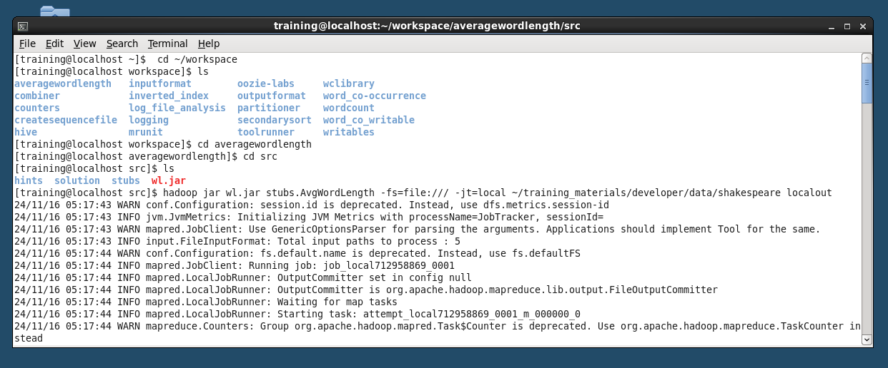

# Run Average Word Length Locally 

The LocalJobRunner requires setting up the file system (-fs) to point to the local file system and specifying 
that the job should run locally (-jt=local).
```
hadoop jar toolrunner.jar stubs.AvgWordLength -fs=file:/// -jt=local ~/training_materials/developer/data/shakespeare localout

```
- `toolrunner.jar`: Your compiled JAR file containing the AvgWordLength class.
- `stubs.AvgWordLength`: The driver class for your Average Word Length program.
- `-fs=file:///`: Sets the program to use the local file system instead of HDFS.
- `-jt=local`: Tells Hadoop to run the job locally, using LocalJobRunner.
- `~/training_materials/developer/data/shakespeare`: Path to the input text data
- `localout`: Output directory on the local file system where results will be saved.




**After the job completes, the localout directory has the output files (part-r-00000), which should contain the results of the average word length calculation.

```
cat localout/part-r-00000

```


## Runnign job from ecplipse


